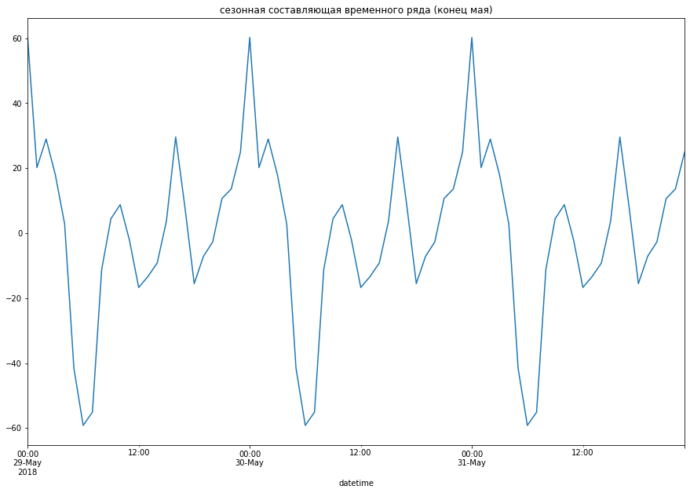

<h1>Содержание<span class="tocSkip"></span></h1>
<div class="toc"><ul class="toc-item"><li><span><a href="#Подготовка" data-toc-modified-id="Подготовка-1"><span class="toc-item-num">1&nbsp;&nbsp;</span>Подготовка</a></span></li><li><span><a href="#Анализ" data-toc-modified-id="Анализ-2"><span class="toc-item-num">2&nbsp;&nbsp;</span>Анализ</a></span></li><li><span><a href="#Обучение" data-toc-modified-id="Обучение-3"><span class="toc-item-num">3&nbsp;&nbsp;</span>Обучение</a></span><ul class="toc-item"><li><span><a href="#Добавление-признаков" data-toc-modified-id="Добавление-признаков-3.1"><span class="toc-item-num">3.1&nbsp;&nbsp;</span>Добавление признаков</a></span></li><li><span><a href="#Модель-RandomForestRegressor" data-toc-modified-id="Модель-RandomForestRegressor-3.2"><span class="toc-item-num">3.2&nbsp;&nbsp;</span>Модель RandomForestRegressor</a></span></li><li><span><a href="#Модель-Lasso" data-toc-modified-id="Модель-Lasso-3.3"><span class="toc-item-num">3.3&nbsp;&nbsp;</span>Модель Lasso</a></span></li><li><span><a href="#Модель-LinearRegression" data-toc-modified-id="Модель-LinearRegression-3.4"><span class="toc-item-num">3.4&nbsp;&nbsp;</span>Модель LinearRegression</a></span></li><li><span><a href="#Сравнение-моделей" data-toc-modified-id="Сравнение-моделей-3.5"><span class="toc-item-num">3.5&nbsp;&nbsp;</span>Сравнение моделей</a></span></li></ul></li><li><span><a href="#Тестирование" data-toc-modified-id="Тестирование-4"><span class="toc-item-num">4&nbsp;&nbsp;</span>Тестирование</a></span></li><li><span><a href="#Выводы" data-toc-modified-id="Выводы-5"><span class="toc-item-num">5&nbsp;&nbsp;</span>Выводы</a></span></li></ul></div>

#  Прогнозирование заказов такси

Компания «Чётенькое такси» собрала исторические данные о заказах такси в аэропортах. Чтобы привлекать больше водителей в период пиковой нагрузки, нужно спрогнозировать количество заказов такси на следующий час. Постройте модель для такого предсказания.

Значение метрики *RMSE* на тестовой выборке должно быть не больше 48.

Вам нужно:

1. Загрузить данные и выполнить их ресемплирование по одному часу.
2. Проанализировать данные.
3. Обучить разные модели с различными гиперпараметрами. Сделать тестовую выборку размером 10% от исходных данных.
4. Проверить данные на тестовой выборке и сделать выводы.


Данные лежат в файле `taxi.csv`. Количество заказов находится в столбце `num_orders` (от англ. *number of orders*, «число заказов»).

## Подготовка


```python
!pip install phik
!pip install -U scikit-learn   
```

```python
#подключение необходимых библиотек

import warnings
import time

import pandas as pd
import numpy as np
import matplotlib.pyplot as plt
import seaborn as sns

from statsmodels.tsa.seasonal import seasonal_decompose

from sklearn.model_selection import train_test_split, GridSearchCV

from sklearn.metrics import root_mean_squared_error, make_scorer

from sklearn.linear_model import LinearRegression, Lasso
from sklearn.ensemble import RandomForestRegressor
from sklearn.dummy import DummyRegressor

from sklearn.model_selection import TimeSeriesSplit
from sklearn.pipeline import Pipeline
from sklearn.compose import ColumnTransformer
from sklearn.preprocessing import RobustScaler

warnings.filterwarnings('ignore')
RANDOM_STATE = 61
TEST_SIZE = 0.1
```


```python
data = pd.read_csv('/datasets/taxi.csv')

data.info()
data.head(10)
```

    <class 'pandas.core.frame.DataFrame'>
    RangeIndex: 26496 entries, 0 to 26495
    Data columns (total 2 columns):
     #   Column      Non-Null Count  Dtype 
    ---  ------      --------------  ----- 
     0   datetime    26496 non-null  object
     1   num_orders  26496 non-null  int64 
    dtypes: int64(1), object(1)
    memory usage: 414.1+ KB


<div>

<table border="1" class="dataframe">
  <thead>
    <tr style="text-align: right;">
      <th></th>
      <th>datetime</th>
      <th>num_orders</th>
    </tr>
  </thead>
  <tbody>
    <tr>
      <th>0</th>
      <td>2018-03-01 00:00:00</td>
      <td>9</td>
    </tr>
    <tr>
      <th>1</th>
      <td>2018-03-01 00:10:00</td>
      <td>14</td>
    </tr>
    <tr>
      <th>2</th>
      <td>2018-03-01 00:20:00</td>
      <td>28</td>
    </tr>
    <tr>
      <th>3</th>
      <td>2018-03-01 00:30:00</td>
      <td>20</td>
    </tr>
    <tr>
      <th>4</th>
      <td>2018-03-01 00:40:00</td>
      <td>32</td>
    </tr>
    <tr>
      <th>5</th>
      <td>2018-03-01 00:50:00</td>
      <td>21</td>
    </tr>
    <tr>
      <th>6</th>
      <td>2018-03-01 01:00:00</td>
      <td>7</td>
    </tr>
    <tr>
      <th>7</th>
      <td>2018-03-01 01:10:00</td>
      <td>5</td>
    </tr>
    <tr>
      <th>8</th>
      <td>2018-03-01 01:20:00</td>
      <td>17</td>
    </tr>
    <tr>
      <th>9</th>
      <td>2018-03-01 01:30:00</td>
      <td>12</td>
    </tr>
  </tbody>
</table>
</div>


В таблице 2 столбца: дата/время и количество заказов в промежутке в 10 минут. Столбец с датой и временем сразу приводим к типу datetime, а затем назначаем индексом строки. Пропусков нет.


```python
data['datetime'] = pd.to_datetime(data['datetime'])
data = data.set_index(data['datetime'])
data = data.drop(['datetime'], axis = 1)
data.info()
data.head()
```

    <class 'pandas.core.frame.DataFrame'>
    DatetimeIndex: 26496 entries, 2018-03-01 00:00:00 to 2018-08-31 23:50:00
    Data columns (total 1 columns):
     #   Column      Non-Null Count  Dtype
    ---  ------      --------------  -----
     0   num_orders  26496 non-null  int64
    dtypes: int64(1)
    memory usage: 414.0 KB


<div>

<table border="1" class="dataframe">
  <thead>
    <tr style="text-align: right;">
      <th></th>
      <th>num_orders</th>
    </tr>
    <tr>
      <th>datetime</th>
      <th></th>
    </tr>
  </thead>
  <tbody>
    <tr>
      <th>2018-03-01 00:00:00</th>
      <td>9</td>
    </tr>
    <tr>
      <th>2018-03-01 00:10:00</th>
      <td>14</td>
    </tr>
    <tr>
      <th>2018-03-01 00:20:00</th>
      <td>28</td>
    </tr>
    <tr>
      <th>2018-03-01 00:30:00</th>
      <td>20</td>
    </tr>
    <tr>
      <th>2018-03-01 00:40:00</th>
      <td>32</td>
    </tr>
  </tbody>
</table>
</div>


Как видно из первых строк, в таблице представлены данные за каждые 10 минут. Проверим, не прерывается ли эта последовательность


```python
print(data.index.is_monotonic)
print('Самое раннее время:', data.index.min(), 'Самое позднее:', data.index.max())
```

    True
    Самое раннее время: 2018-03-01 00:00:00 Самое позднее: 2018-08-31 23:50:00


Таких сбоев не обнаружено. В таблице приведены данные с полуночи 1 марта 2018 года по 23:50 31 августа 2018 года.

Сразу можно сказать, что по таким данным никакая модель не сможет проанализировать сезонные изменения в течение года (рост и спад спроса в зависимости от времени года), т.к. для этого требуется информация за несколько лет. А у нас отсутствует информация о спросе осенью и зимой в целом.

Проведем ресеплирование данных по одному часу


```python
old_data = data.copy()
data = data.resample('1H').sum()
data.info()
data.head()
```

    <class 'pandas.core.frame.DataFrame'>
    DatetimeIndex: 4416 entries, 2018-03-01 00:00:00 to 2018-08-31 23:00:00
    Freq: H
    Data columns (total 1 columns):
     #   Column      Non-Null Count  Dtype
    ---  ------      --------------  -----
     0   num_orders  4416 non-null   int64
    dtypes: int64(1)
    memory usage: 69.0 KB


<div>

<table border="1" class="dataframe">
  <thead>
    <tr style="text-align: right;">
      <th></th>
      <th>num_orders</th>
    </tr>
    <tr>
      <th>datetime</th>
      <th></th>
    </tr>
  </thead>
  <tbody>
    <tr>
      <th>2018-03-01 00:00:00</th>
      <td>124</td>
    </tr>
    <tr>
      <th>2018-03-01 01:00:00</th>
      <td>85</td>
    </tr>
    <tr>
      <th>2018-03-01 02:00:00</th>
      <td>71</td>
    </tr>
    <tr>
      <th>2018-03-01 03:00:00</th>
      <td>66</td>
    </tr>
    <tr>
      <th>2018-03-01 04:00:00</th>
      <td>43</td>
    </tr>
  </tbody>
</table>
</div>


## Анализ

Посмотрим на график зависимости количества заказов от времени


```python
plt.rcParams['figure.figsize'] = [15, 10]
data.plot()
```


    <AxesSubplot:xlabel='datetime'>


    

    


Мало что ясно, кроме наличия малой периодичности (вероятно, в течение дня) и некоем увеличеснии максимально числа заказов в день в августе. Посмотрим на скользящее среднее с размером окна в сутки


```python
data.rolling(24).mean().plot()
plt.show()
```


    

    


Нетрудно заметить восходящий тренд. Разложим ряд на тренд, сезонную состовляющую и остаток


```python
plt.rcParams['figure.figsize'] = [15, 30]
data_decompose = seasonal_decompose(data)
plt.subplot(3, 1, 1)
data_decompose.trend.plot()
plt.title('тренд временного ряда')
plt.subplot(3, 1, 2)
data_decompose.seasonal.plot()
plt.title('сезонная составляющая временного ряда')
plt.subplot(3, 1, 3)
data_decompose.resid.plot()
plt.title('остаток временного ряда')
plt.show()
```


    

    


Восходящий тренд подтвердился, а сезонная составляющая выглядит непонятно. Посмотрим на трехдневном отрезке


```python
plt.rcParams['figure.figsize'] = [15, 10]
data_decompose = seasonal_decompose(data)
data_decompose.seasonal['2018-05-29':'2018-05-31'].plot()
plt.title('сезонная составляющая временного ряда (конец мая)')
plt.show()
```


    

    


Виден ежедневный цикл, не меняющийся значительно в течение всего времени измерений. Посмотрим на это распределение в течение дня и сделаем выводы о сезонной составляющей


```python
plt.rcParams['figure.figsize'] = [15, 10]
data_decompose.seasonal['2018-05-20 00:00':'2018-05-20 23:50'].plot()
plt.title('Сезонная составляющая в течение дня')
plt.show()
```


    

    


Видим, что:

* Самое большое число заказов обычно около полуночи

* Меньше всего заказов около 6 утра

* Также локальные максимумы активности в 10-11 утра и около 5 вечера

В заключении посмотрим на график изменения числа пассажиров каждый день


```python
data_days = data.resample('1D').sum()
diff_days = data_days - data_days.shift()
diff_days.plot()
plt.title('Изменение числа пассажиров каждый день')
plt.show()
```


    

    


Как мы видим, несмотря на общий восходящий тренд, число пассажиров за день постоянно колеблется. Вероятно, не учтена бо́льшая периодичность - в течение месяца или недели. Посмотрим на сезонную составляющую данных, семплированных по дням


```python
days_decompose = seasonal_decompose(data_days)
days_decompose.seasonal.plot()
plt.title('Сезонная составляющая числа заказов в день')
plt.show()
```


    

    


Судя по частоте, видно, что речь о недельной периодичности


```python
data_in_week = pd.DataFrame(days_decompose.seasonal['2018-04-30':'2018-05-06'])
data_in_week['day_of_week'] = data_in_week.index.weekday
data_in_week['day_of_week'] = data_in_week['day_of_week'].replace({0 : 'Monday', 1 : 'Tuesday', 2 : 'Wednesday',\
                                                                 3 : 'Thursday', 4 : 'Friday', 5 : 'Saturday', 6 : 'Sunday'})
data_in_week = data_in_week.set_index(data_in_week['day_of_week'])
data_in_week = data_in_week.drop(['day_of_week'], axis = 1)
data_in_week.plot()
plt.title('Сезонная составляющая в течение недели')
plt.show()
```


    

    


Как мы видим:

* Самые загруженные дни - понедельник и пятница

* Самые незагруженные дни - вторник и суббота

## Обучение

### Добавление признаков

Как мы выяснили на этапе анализа данных, в данном временном ряде присутствует общий восходящий тренд, недельная периодичность и ежедневная периодичность. Таким образом, помимо даты следует добавить в таблицу столбцы с часом и днем недели. Также добавим скользящее среднее с окном в 12 часов и функцию отставания на час и на сутки.


```python
data['day_of_week'] = data.index.weekday
data['hour'] = data.index.hour
data['lag_hour'] = data['num_orders'].shift(1)
data['lag_day'] = data['num_orders'].shift(24)
data['rolling_mean'] = data['lag_hour'].rolling(12).mean()
```

Так как первые сутки столбцу *lag_day* неоткуда взять данные, там образовываютмся пустые значения. Для чистоты тренировочной выборки удалим этот день (в масштабе имеющихся у нас 6 месяцев это незначительные потери)


```python
print('Размер датасета до удаления:', data.shape)
data = data.dropna()
print('Размер датасета после удаления:', data.shape)
```

    Размер датасета до удаления: (4416, 6)
    Размер датасета после удаления: (4392, 6)


Разделим данные на тренировочную и тестовую выборки в отношении 9:1


```python
y = data['num_orders']
X = data.drop(['num_orders'], axis = 1)
X_train, X_test, y_train, y_test = train_test_split(X, y, shuffle = False, test_size = TEST_SIZE)

print('Границы тренировочной выборки', X_train.index.min(), X_train.index.max())
print('Границы тестовой выборки', X_test.index.min(), X_test.index.max())
```

    Границы тренировочной выборки 2018-03-02 00:00:00 2018-08-13 15:00:00
    Границы тестовой выборки 2018-08-13 16:00:00 2018-08-31 23:00:00


Для поиска лучшей модели обучим следующие модели: линейная регрессия, лассо и случайный лес. Качество моделей будем оценивать по метрике RMSE. Также для проверки качества прогноза создадим модели, возвращающие значение целевого признака час назад и возвращающеие среднее значение по выборке.

### Модель RandomForestRegressor


```python
preprocessor_pipe = ColumnTransformer(
    [
        ('num', RobustScaler(), X.columns.to_list())
    ],
    remainder = 'passthrough'
)
rmse = make_scorer(root_mean_squared_error, greater_is_better = False)
```


```python
pipe_forest = Pipeline(
   [
        ('preprocessor', preprocessor_pipe),
        ('model', RandomForestRegressor(random_state = RANDOM_STATE))
   ]
)

param_grid_forest = [
    {
        'model__n_estimators': [5, 10, 50, 100],
        'model__max_depth': [2, 5, 10],
        'model__min_samples_leaf': [1, 2, 5]
    }
]

grid_forest = GridSearchCV(
    pipe_forest,
    param_grid = param_grid_forest,
    cv = TimeSeriesSplit(n_splits = 5),
    scoring = rmse,
    n_jobs = -1
)

grid_forest.fit(X_train, y_train)
print('Параметры лучшей модели:', grid_forest.best_params_)
rmse_forest = abs(round(grid_forest.best_score_))
print('Метрика rmse лучшей модели RandomForestRegressor на тренировочной выборке', rmse_forest)
forest_model = grid_forest.best_estimator_
```

    Параметры лучшей модели: {'model__max_depth': 10, 'model__min_samples_leaf': 2, 'model__n_estimators': 100}
    Метрика rmse лучшей модели RandomForestRegressor на тренировочной выборке 25


### Модель Lasso


```python
pipe_lasso = Pipeline(
   [
        ('preprocessor', preprocessor_pipe),
        ('model', Lasso(random_state = RANDOM_STATE))
   ]
)

param_grid_lasso = [
    {
        'model__alpha': [0.001, 0.01, 0.1, 0.5, 1],
        'model__max_iter':[100, 500, 1000, 5000]        
    }
]

grid_lasso = GridSearchCV(
    pipe_lasso,
    param_grid = param_grid_lasso,
    cv = TimeSeriesSplit(n_splits = 5),
    scoring = rmse,
    n_jobs = -1
)

grid_lasso.fit(X_train, y_train)
print('Параметры лучшей модели:', grid_lasso.best_params_)
rmse_lasso = abs(round(grid_lasso.best_score_))
print('Метрика rmse лучшей модели Lasso на тренировочной выборке', rmse_lasso)
lasso_model = grid_lasso.best_estimator_
```

    Параметры лучшей модели: {'model__alpha': 0.001, 'model__max_iter': 100}
    Метрика rmse лучшей модели Lasso на тренировочной выборке 27


### Модель LinearRegression


```python
lr_model = LinearRegression()
lr_model.fit(X_train, y_train)
lr_train_predict = lr_model.predict(X_train)
rmse_lr = round(root_mean_squared_error(y_train, lr_train_predict))
print('Метрика rmse модели LinearRegression на тренировочной выборке', rmse_lr)
```

    Метрика rmse модели LinearRegression на тренировочной выборке 27


### Сравнение моделей


```python
def get_time_train(model, X_train, y_train):
    st = time.time()
    model.fit(X_train, y_train)
    fin = time.time()
    return round(fin - st, 3)

def get_time_predict(model, X_train):
    st = time.time()
    t = model.predict(X_train)
    fin = time.time()
    return round(fin - st, 3)
```


```python
dum = DummyRegressor(strategy = 'mean')
time_lr_train = get_time_train(lr_model, X_train, y_train)
time_lasso_train = get_time_train(lasso_model, X_train, y_train)
time_forest_train = get_time_train(forest_model, X_train, y_train)
time_dummy_train = get_time_train(dum, X_train, y_train)

time_lr_pred = get_time_predict(lr_model, X_train)
time_lasso_pred = get_time_predict(lasso_model, X_train)
time_forest_pred = get_time_predict(forest_model, X_train)
time_dummy_pred = get_time_predict(dum, X_train)

dum.fit(X_train, y_train)
temp = dum.predict(X_train)
rmse_dum = round(root_mean_squared_error(temp, y_train))

st = time.time()
pred_previous = y_train[1:].shift(fill_value = y_train[0])
fin = time.time()
time_prev_pred = round(fin - st, 3)
rmse_prev = round(root_mean_squared_error(pred_previous, y_train[1:]))
```


```python
time_df = pd.DataFrame(np.array([['LinearRegression', rmse_lr, time_lr_train, time_lr_pred],
                                 ['Lasso', rmse_lasso, time_lasso_train, time_lasso_pred],
                                 ['RandomForestRegressor', rmse_forest, time_forest_train, time_forest_pred],
                                 ['Среднее значение', rmse_dum, time_dummy_train, time_dummy_pred],
                                 ['Предыдущее значение', rmse_prev, '-', time_prev_pred]]),
                      columns = ['Модель', 'rmse на тренировочной выборке', 'Время обучения, c', 'Время предсказания, c'])
time_df = time_df.set_index('Модель')
display(time_df)
```


<div>

<table border="1" class="dataframe">
  <thead>
    <tr style="text-align: right;">
      <th></th>
      <th>rmse на тренировочной выборке</th>
      <th>Время обучения, c</th>
      <th>Время предсказания, c</th>
    </tr>
    <tr>
      <th>Модель</th>
      <th></th>
      <th></th>
      <th></th>
    </tr>
  </thead>
  <tbody>
    <tr>
      <th>LinearRegression</th>
      <td>27</td>
      <td>0.003</td>
      <td>0.002</td>
    </tr>
    <tr>
      <th>Lasso</th>
      <td>27</td>
      <td>0.009</td>
      <td>0.005</td>
    </tr>
    <tr>
      <th>RandomForestRegressor</th>
      <td>25</td>
      <td>0.994</td>
      <td>0.21</td>
    </tr>
    <tr>
      <th>Среднее значение</th>
      <td>39</td>
      <td>0.001</td>
      <td>0.0</td>
    </tr>
    <tr>
      <th>Предыдущее значение</th>
      <td>36</td>
      <td>-</td>
      <td>0.001</td>
    </tr>
  </tbody>
</table>
</div>


Обученные модели заметно эффективнее вариантов заполнения средним или предыдущим значением.

По метрике RMSE самая эффективная модель - RandomForestRegressor, однако она обучалась и выдавала прогноз примерно в 50-100 раз дольше, чем Lasso, у которой метрика rmse не сильно больше. Поэтому возможно следует отдать предпочтение модели Lasso (если в дальнейшем модель планируют использовать на куда больших объемах данных)


```python
model = lasso_model
```

## Тестирование


```python
test = X_test.join(y_test)
test['predict'] = model.predict(X_test)
rmse = root_mean_squared_error(test['predict'], y_test)
print('Метрика rmse выбранной модели на тестовой выборке', rmse)
```

    Метрика rmse выбранной модели на тестовой выборке 47.213709204374226


Результат на тестовой выборке удволетворяет изначальным требованиям - метрика rmse менее 48 

Выведем график предсказанных и реальных значений целевого признака


```python
y_test.plot(label = 'реальные значения')
test['predict'].plot(label = 'предсказанные значения')
plt.legend()
plt.title('Сравнение предсказанных и реальных значений целевого признака на тестовой выборке')
plt.show()
```


    

    


```python
y_test.rolling(24).sum().plot(label = 'реальные значения')
test['predict'].rolling(24).sum().plot(label = 'предсказанные значения')
plt.legend()
plt.title('Сравнение предсказанного и реального количества заказов в день')
plt.show()
```


    

    


Как видно из графика, общий вид зависимости в предсказании сохранился (рост и спад заказов), однако до абсолютного наложения далеко

## Выводы

В ходе работы была изучена статистика о количестве заказов такси в период с 1 марта по 31 августа 2018 года. На этапе анализа было выяснено следующее:

1) Функция количества заказов от времени имеет восходящий тренд

2) Функция обладает сезонностью в масштабе дня и масштабе недели:

* В среднем самые загруженные часы : полночь и 5 вечера, самый незагруженный: 6 утра

* В среднем самые загруженные дни недели: понедельник и пятница , самые незагруженные: вторник и воскресенье

Важно уточнить, что из-за малого периода измерений (полгода) нет возможности узнать, например, про сезонные изменения в течение года: таким образом, восходящий тренд может быть или показателем роста компании, и роста спроса на такси к концу лета. Так что при экстраполяции модели на осень и зиму она может давать серьезные просчеты

Было обучено 3 модели: Lasso, LinearRegression и RandomForestRegressor. Из них по метрикам лучшей оказалась RandomForestRegressor, однако работает она значительно медленнее модели Lasso, результаты которой не сильно хуже. Поэтому предпочтение было отданно модели Lasso. На тестовой выборке модель показала необходимый результат: метрика rmse менее 48.
